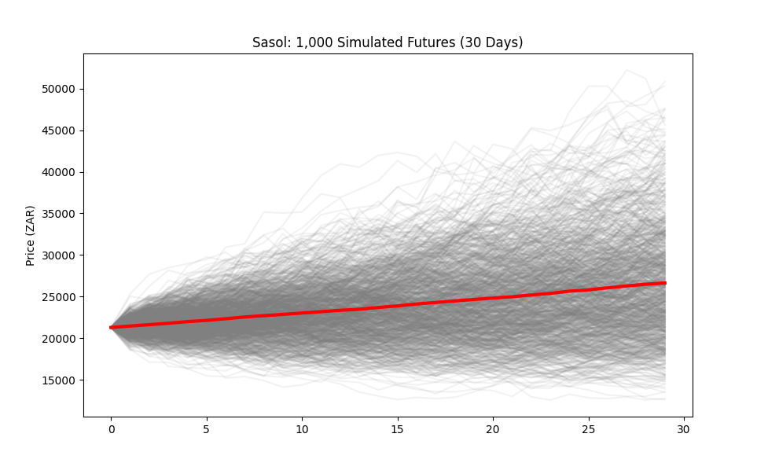

# JSE-Quant-Analysis

Quantitative research and backtesting engine for JSE energy stocks (SOL.JO) using statistical arbitrage and Monte Carlo simulations.

##  Executive Summary
This repository contains a Python-based quantitative research project focusing on a Mean-Reversion Strategy for Sasol Ltd (SOL.JO). By modeling its historical correlation with Brent Crude Oil ($BZ=F$), I identified price decouplings (inefficiencies) and backtested a systematic trading strategy.

##  Technical Implementation
* **Data Engineering**: Automated multi-asset data retrieval using `yfinance`, handling MultiIndex DataFrames and cleaning 6 months of historical time-series data.
* **Signal Generation**: Developed a rolling Z-Score model of the price spread. (Logic: Buy when Sasol is 2 std devs below its relationship with Oil; Sell when 2 std devs above).
* **Vectorized Backtesting**: Built a PnL engine using `NumPy` and `Pandas` to calculate cumulative returns, avoiding slow loops to ensure performance awareness.
* **Risk Modeling**: Executed a 1,000-path Monte Carlo Simulation based on Sasol's 71% annualized volatility to determine the probability of strategy failure.

## Key Results
* **Absolute Return**: ~32% over the backtest period.
* **Correlation Alpha**: Successfully exploited a 0.96 correlation between the JSE-listed energy giant and global oil benchmarks.
* **Volatility Analysis**: Determined that while the strategy is high-yield, the extreme variance requires rigorous position-sizing and risk-management protocols.

### Strategy Performance

### Risk Stress Test (Monte Carlo)

## How to Run
1. Clone the repository.
2. Install dependencies: `pip install yfinance pandas numpy matplotlib`.
3. Run `main_quant_script.py`.
